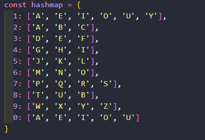
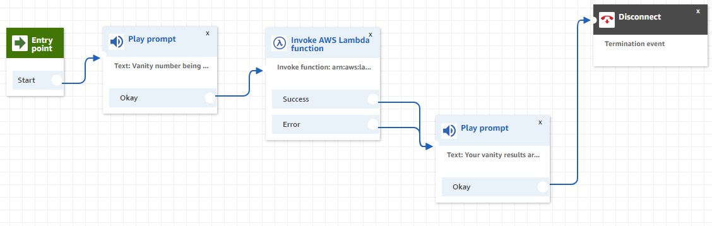

# VoiceFoundry Assessment Assignment

## Call (646) 821-8096
To have your vanity number generated.

## Resources
This project uses Node/JS in a lambda function, DynamoDB as our non-relational database for storing results, and Amazon Connect to tie together Prompts, the Lambda Function, and to return(read) results to the end user.

### Node
In our NodeJS file/lambda function the first step I took was to write out a hashmap with the idea of T9 format in mind, while in T9 the numbers 1(one) and 0(zero) don't have Letter values. In the hashmap I had them be equal to vowels, with the exception of 'Y' in the number 0(zero).

The next step was to isolate the number and remove the '+1' from the event Object returned, this was a hurdle at first being ignorant to Lambda's event Object.

After getting our inputed phone number it's time change the number into an array. I changed the number to an array as array's are easier to manipulate over strings. I used a for loop to loop over the last X(4) amount of characters and changed them based on the hashmap. Admittedly this would have been neater code if I had used an array method such as .forEach() or .map(), but with little to no difference in time complexity I opted to stay with a for loop.

In order to ensure some uniqueness in our results I added a function to generate 100 'results' so that we could filter those down to 5.

The way I decided to 'filter' the 100 results down to 5 was more of a first come first serve, the first 5 results looped through that had a vowel at the end of the result was pushed into a results array.

Next was the trickiest portion of this assignment, writing to the DynamoDB, initially I wrote the NodeJS script locally and tested writing to DynamoDB locally as well, thinking there'd be similarities, and there were! However there was small syntax differences that caught me off guard and after digging on google, stackoverflow, as well as AWS documentation, I found the correct method's I was looking for, and the correct syntax for passing in the parameters.

### Amazon Connect
Amazon Connect, the newest piece of technology to me for this assignment. It took some time understanding how to construct a call flow, and after learning how things connected and interacted with each other these are the options I took. Entry Point -> Play Prompt(notifying user that vanity number is being generated) -> Invoke Lambda Function -> Play Prompt(relay vanity numbers to user) -> Disconnect. Throughout configuring the Amazon Connect portion of this assignment, relaying the results proved to be the most difficult, I could see the lambda function was working as intended as the DynamoDB table was updated with every test. Once I understood how to call external variables from a lambda function that had executed directly before a prompt, I was able to have the prompt relay the 'top 3' results.
